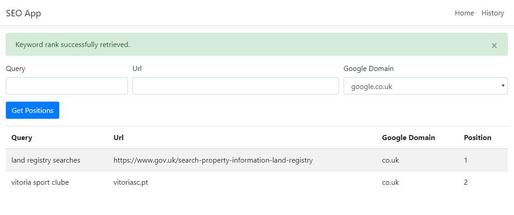
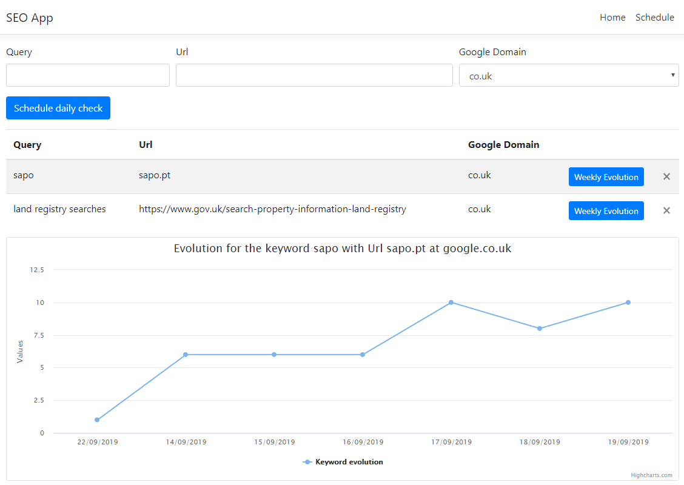

# SEO App

A simple app built with .NET Core, React, HangFire, Highcharts and SQL Server to check the position of an Url for a given keywork in Google. You can also schedule a daily check for a given keyword, which can be visualized graphically.

## Prerequisites

* [SQL Server Express](https://www.microsoft.com/sql-server/sql-server-editions-express) - The SQL Server Express connection string can be changed at SEO-API/appsettings.json.
* [Visual Studio with .NET Core SDK 2.2 or later](https://www.microsoft.com/net/download/all)

## Running the app

* `npm install` to install all req'd dependencies
* `npm start` to start the React App.

### For the .NET Core project:

* `dotnet restore`
* `dotnet build`
* `dotnet run`

Alternatively, you can also run the 2 apps inside Visual Studio.

## Images

